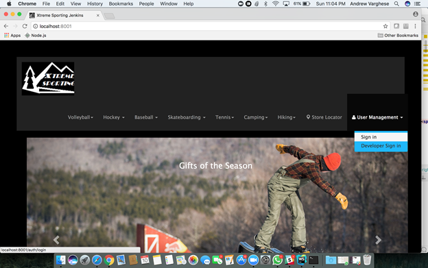
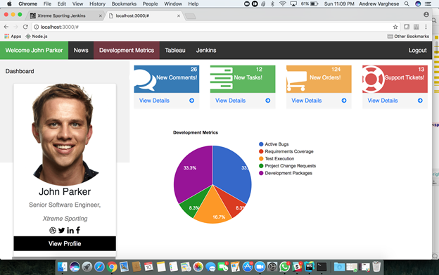
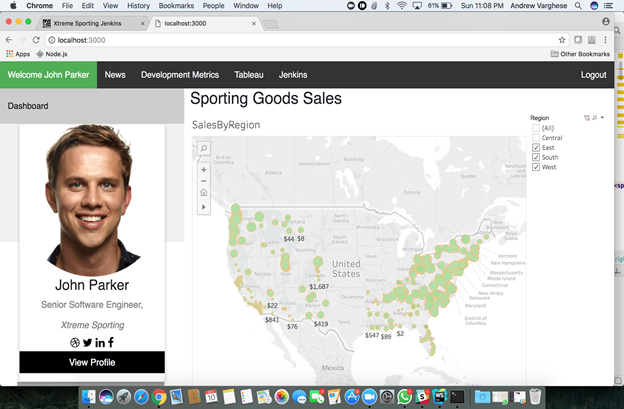

# Xtreme Sporting

======================
    
    University Name: http://www.sjsu.edu/
    Course: Enterprise Software Platforms CMPE-272
    Professor: Andrew Bond
    ISA: Abhishek
    
    Team Members:
    
    • Anjana Eldo 
    • Anjana Kamath Miyar
    • Rupal Martin 
    • Vidya CN
    
======================

## Features offered:

The objective of this project is to create an ecommerce web application which involves secure trading of sporting products
between the business and the consumer and enhancing business prospect by integrating third party APIs (Jenkins/Tableau/Google Maps/Facebook/Twitter share). 
The portal has a web based interface which allows the customers to securely sign in to the application using SSO with Azure AD, 
browse through the catalog, search products, add the products to cart and make payments online. 

 Technologies Used:
    
    • Node JS\ExpressJS
    • MongoDB
    • Jenkins
    • SSO
    • Tableau
    • Google Maps
    

## Login Page

    
    
## Application Dashboard 

    
    
##  Developer Dashboard Page

    
    
## Developer Tableau Integration page

    
    
